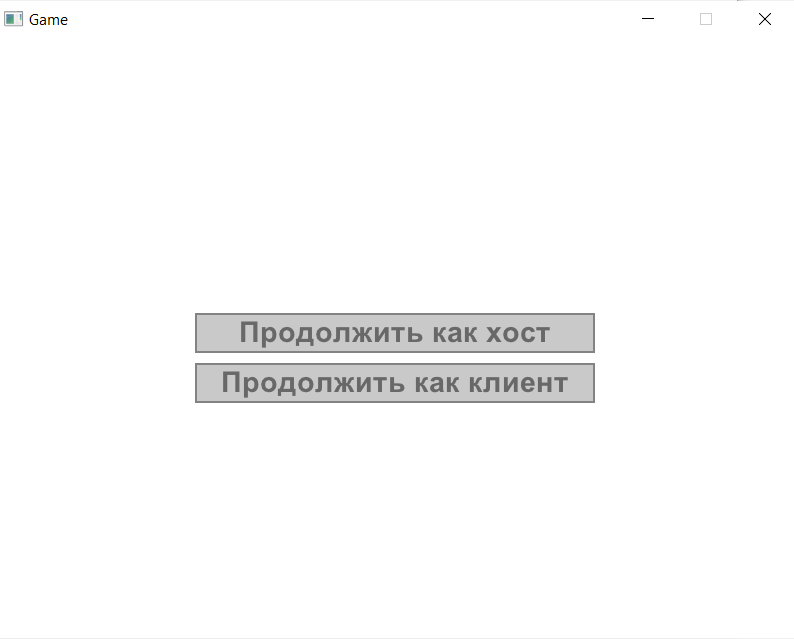
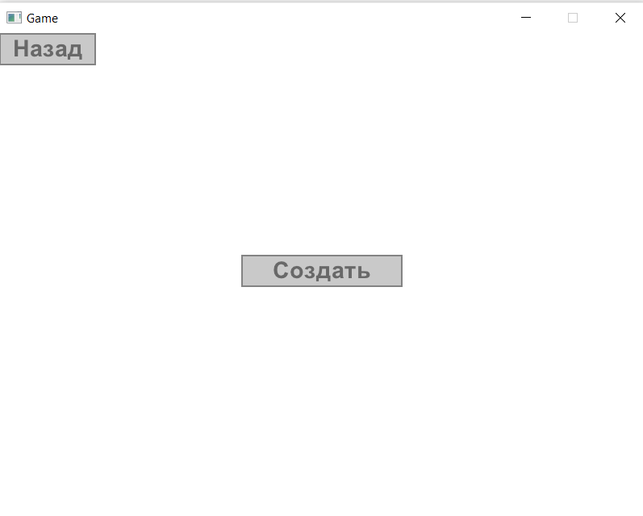
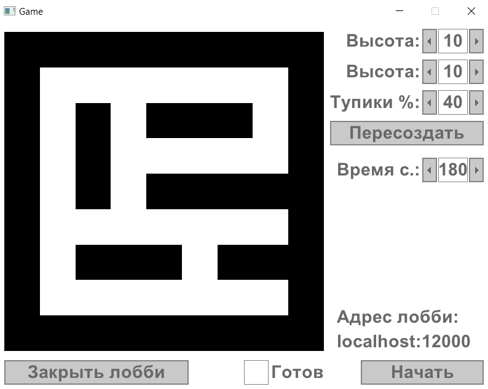
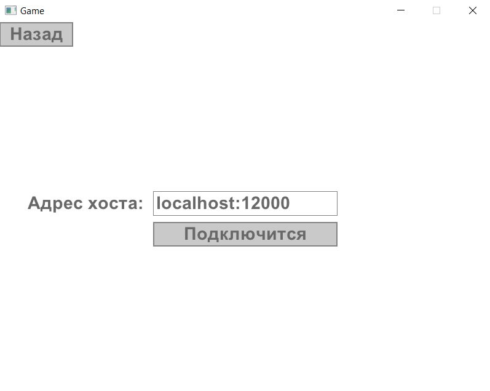
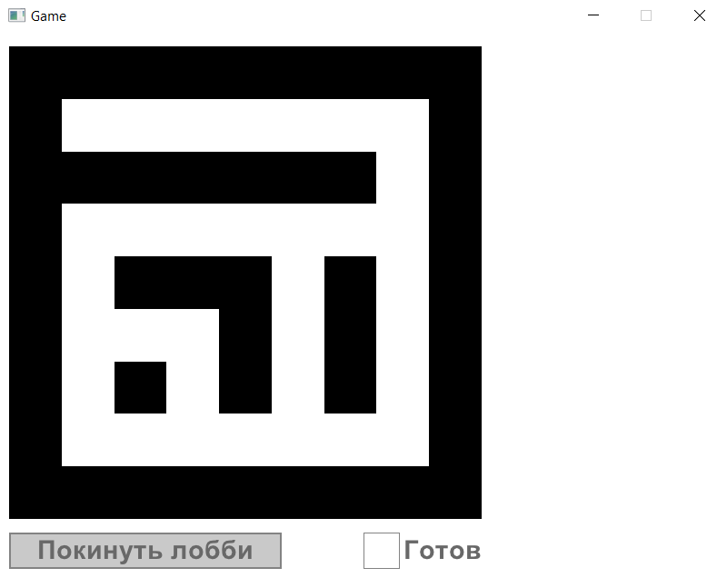
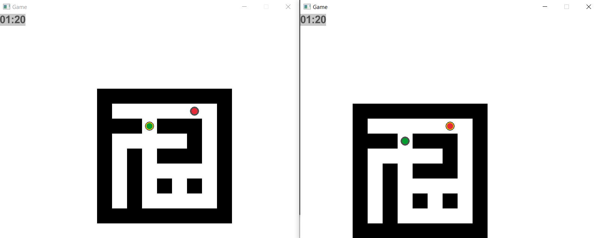
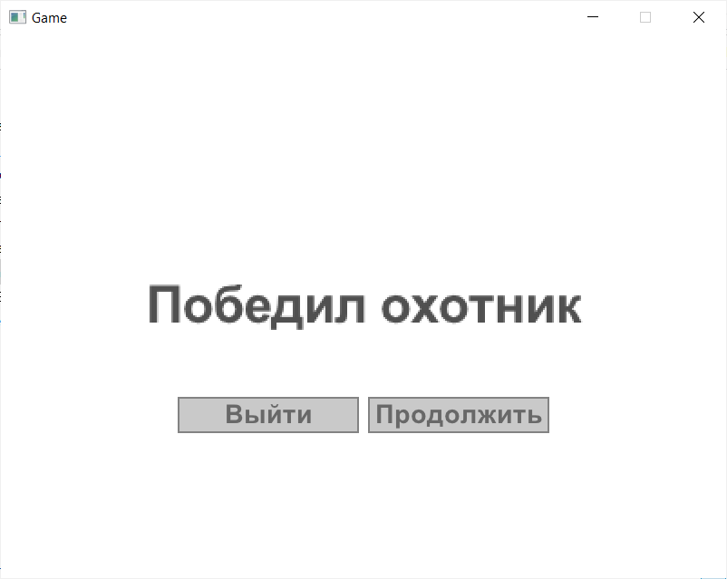

# Игра в стиле hide and seek на python

## Установка

Во первых, необходимо установить интерпретатор python версии >= 3.9.

Во вторых, желательно, но не обязательн создать виртуальное окружение.

```
cd second_project
python -m venv venv
venv\Scripts\activate.bat
```

На последнем шаге необходимо установить зависимости.

```
pip install -r requirements.txt
```

## Запуск

Для запуска приложения достаточно запускить файл main.py из директории проекта

```
python main.py
```

Чтобы запустить игру без консоли, можно использовать pythonw

```
pythonw main.py
```

## Начало игры

В главном меню игры есть 2 кнопки: "Продолжить как хост" и "Продолжить как клиент"



### Если мы хост

Нажимаем кнопку "Создать" и попадаем в лобби.





Панель лобби хоста состоит из 3 панелей:

1. Демо карты. Всем игрокам лобби виден паттерн карты
2. Панель настроек. Тут можно изменить такие параметры, как время игры, размеры и плотность карты
3. Панель запуска. Через это меню можно изменить статус готовности, распустить лобби или начать игру

### Если мы клиент

Нам необходимо ввести адрес и порт хоста. Хост и клиент должны находится в одной сети.


Если подключение произошло успешно, вы попадете в лобби.

В лобби клиента всего 2 панели:

1. Демо карты. Все члены лобби видят актуальную карту.
2. Панель запускаю. Через нее можно покинуть лобби и изменить статус готовности.

 

## Геймплей

Управление происходит при помощи стандартных WASD.

Охотники помечены красным цветом, жертвы зеленым. Третий тип игроком помечается серым цветом, это призраки. Призраков могут видеть только другие призраки. Ваш персонаж дополнительно помечен желтым кольцом.

Цель охотников - поймать всех жертв. Для этого нужно просто коснутся их. Цель жертв продержаться до конца таймера в левом верхнем углу



## Конец игры

Когда победитель будет определен, вас перенесет в меню. Из этого меню можно выйти изи игры или вернутся в лобби.
